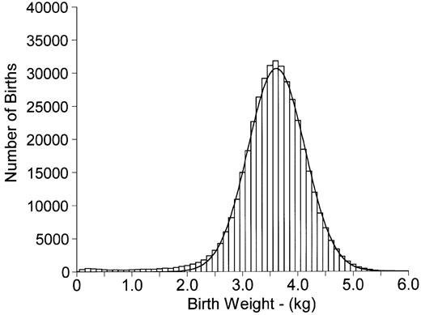
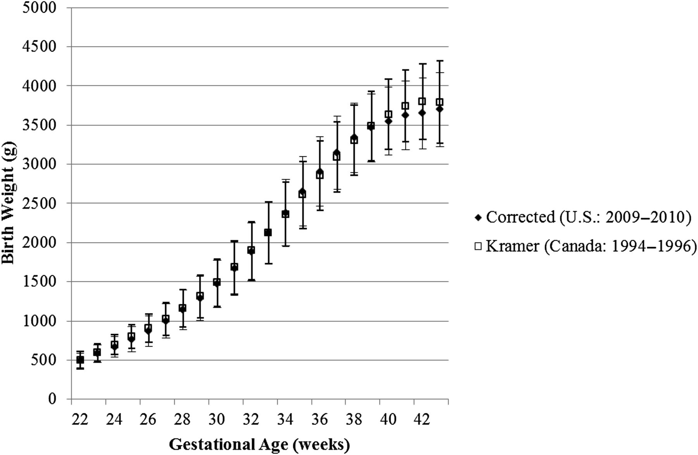

## Birth weight

Birth weight is a commonly-used indicator of a newborn infant's health status. Because this indicator is easily obtained, it is a critical component of population health reporting by the World Health Organization and governments around the globe. The distribution of birth weight has often been described as approximately normal, though the left tail in particular is inflated relative to that from a Gaussian distribution.

## Distribution of birth weight

## Variability in birth weight

Much of the variability in birth weight is explained by gestational age at delivery. A baby typically spends around 38 weeks in the uterus, but the average length of gestation is counted at 40 weeks. Pregnancy is counted from the last day of a woman's menstrual period (which is easily measured), but the date of conception (not so easy to measure) is typically around two weeks later.

## Birth weight as a function of gestational age

{width=70%}

## Case Study Data

You will visualize data on birth weight and gestational age at delivery for babies born in North Carolina from 2011-2016. The source of these data is the North Carolina State Center for Health Statistics. Relevant variables include the following.

- Birth weight in g (primary outcome variable)
- Gestational age in weeks (babies should gain weight until delivery)
- Biological sex assigned at birth (boys are heavier on average)

## Case Study Data

- Parity, or the woman's number of births including this one (on average, a woman's later babies are expected to weigh more than the first due to incomplete reversion of physiologic changes that occur during pregnancy to facilitate fetal growth, thus creating a more efficient system for later pregnancies)
- Plurality (singleton births usually weigh more than twins or higher-order multiples). Note that including multiple births to a mother (whether at one time or over a period of years) is a violation of any assumption of independence of observations.

## Case Study Data

- Maternal smoking (smoking is associated with lower birth weight; pregnant women are encouraged to quit smoking)
- Maternal age (be sure to explore nonlinear trends, as very young mothers and older mothers are often at higher risk)
- Maternal race (health disparities in birth weight have been identified in the literature, though mechanisms are largely unknown)
- Hispanic origin of mother
- Year of birth (useful to determine if there are any time trends)
- County of residence (very rough proxy for socio-economic status)

## Data Source: CIA Factbook

The CIA World Factbook is a reference resource produced by the US Central Intelligence Agency. It is available online and updated (in part) weekly. Topics covered by this almanac include demographics, geography, communications, government, economy and military.

While convenient, the Factbook is not error-free and does not cite its sources, leading to some difficulty verifying figures. For example, demographic statistics describing Albania as 70\% Muslim, 20\% Eastern Orthodox, and 10\% Roman Catholic were based on a 1939 survey and only recently updated. Similarly, the fertility rate of 0.78 children/woman reported for Singapore is at odds with other recent figures.

## Infant Mortality

*Infant mortality*, the death of an infant before the first birthday, provides key information about overall health of a society. The *infant mortality rate* is typically presented as the number of deaths per 1000 births. 

## Goals

- explore health data, visually characterizing the relationship between each factor and birth weight
- explore infant mortality worldwide, creating informative visual displays describing the infant mortality burden around the world

