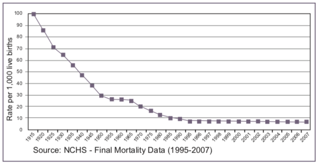
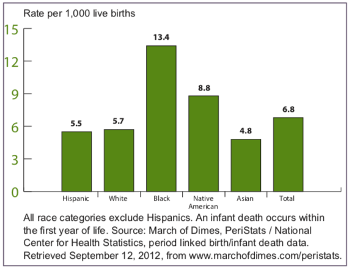
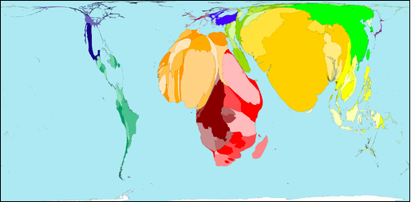

```{r setup, include=FALSE}
knitr::opts_chunk$set(echo = TRUE)
library(countrycode)
```

## Case Study 2: Data Visualization

Using data relevant to countries around the world, we will explore data science tools to tell complex stories through data visualization. We will consider data on infant mortality in class, and for the report you are welcome to use any data that can be plotted by country.


## Case Study Data

- Information for plotting data by country: http://dev.maxmind.com/static/csv/codes/country_latlon.csv 
- CIA Factbook Data: https://www.cia.gov/library/publications/download/
- World Bank Data: https://data.worldbank.org 
- Our World in Data: https://ourworldindata.org 
- Data of your own choosing on world issues

## Case Study Goals

Using data from the World Bank or a complex data source of your own choosing, 
- create an R visualization to illustrate an aspect of our world in data
- create an accompanying Tableau dashboard interactive visual presentation of our world in data
- explain your figures to class in an oral presentation by the group

## Case for Class: Infant Mortality

*Infant death* is defined as the death of a live-born infant during the first year of life. The *infant mortality rate* is the number of infant deaths per 1000 live births. The infant mortality rate, which is relatively easily measured even in resource-poor settings, is often used as a marker of the overall health of a society because of the overlap in causes of infant mortality and factors that are likely to influence the health of an overall population, such as general living conditions, poverty and socioeconomic status, quality of medical care, and rates of illness. Infant mortality rates can be compared across different areas or across time to evaluate the impact of public health program or to determine where new investments in health are needed.

## Changes in US Infant Mortality over Time



What do you think about the way the authors chose to display time in the plot?

## Disparities in Infant Mortality Rate
While overall infant mortality rates in the US have declined over time, major disparities in infant mortality rates exist, shown here as a function of race and ethnicity.
{width=55%}

## Infant Mortality Worldwide

Worldmapper http://archive.worldmapper.org/display.php?selected=261 created a visualization of infant mortality worldwide in 2002, rescaling each country by its contribution to infant deaths worldwide. 

 


##Mapping Infant Mortality

In order to create our map of infant mortality around the world, we will need to identify the following data.

- Infant mortality data for time period of interest by country
- Country mapping information and link to infant mortality data

## Extracting Latitude and Longitude of Country Centroids

First, we will obtain latitude and longitude information for the center of each country. We can then link that to infant mortality rates for each country.

```{r readlatlong}
latlonDF <-read.csv("http://dev.maxmind.com/static/csv/codes/country_latlon.csv")
head(latlonDF)
```
Hmm, it would be nice to have a crosswalk between the 2-letter code in iso.3166.country and the country name.

## R Can Do That!

R has a nifty package, `countrycode`, that contains a crosswalk between many identification and coding schemes for countries (e.g., English name, German name, World Bank, International Olympic Committee, Food and Agricultural Organization of the UN, International Monetary Fund, ISO-2, ISO-3). We can use it to attach the names to our ISO 3166 2-digit codes.

First, we install the library.

```{r countrycode, eval=FALSE}
install.packages("countrycode"")
library(countrycode)
```

##  Country Name Variable
Now we create the country name variable.
```{r countryvar}
latlonDF$country=countrycode(latlonDF$iso.3166.country,"iso2c","country.name")
```

## What's the Warning?

Three codes did not match:  AN, AP, \& EU. Looking at the ISO 3166 codes online, we see these codes are not currently in use, though they were contained in our latitude/longitude file. For now we will ignore them.


## Population & Infant Mortality Data
The data files for population and infant mortality in 2017 are available on the course website. For those of you interested in how to extract this information from the CIA factbook - see the tutorial on the course website. 

```{r loadpopmort}
load("~/Documents/GitHub/Global-Health-758/decks/data/pop_data.RData")
load("~/Documents/GitHub/Global-Health-758/decks/data/IM_data.RData")
```


## Merging the Demographic Data

First we'll combine the demographic data on infant mortality and population size because these come from the same source and consequently should have fewer problems with matching. 

```{r mergepopmort}
IMPop = merge(IM_data, pop_data, by = "country", all = FALSE)
```


## Missed Merges

In the merge of infMortDF and popDF, some rows were excluded from the resulting data frame. Determine which rows in one data frame did not find a match in the other. 

Check to see if all countries in the infant mortality dataset are also in the population size dataset:
```{r mortinpop}
IM_data$country[which((!IM_data$country %in% pop_data$country))]
```

## Missed Merges

Which countries are in the population data set but not the infant mortality data set?
```{r popinmort}
pop_data$country[which((!pop_data$country %in% IM_data$country))]
```

## Merging the geographic and demographic data sets

```{r mergegeodemo}
allCtryData = merge(IMPop, latlonDF, by="country", all = FALSE)
```

## Missed Merges

Which countries are in the spatial data but not the Factbook data?
```{r inspatialnotfact}
latlonDF$country[which((!latlonDF$country %in% IMPop$country))]
```

## Missed Merges

Which countries are in the Factbook data set but not the spatial data set?
```{r infactnotspatial}
IMPop$country[which((!IMPop$country %in% latlonDF$country))]
```


## Initial Plot - The Colors
First, we'll begin by selecting the colors for our plot. We'll select only 5 colors, and consequently 5 levels of mortality, because it’s difficult for our eyes to distinguish among more than 5 to 7 colors.

```{r pickcolors}
library(RColorBrewer)
#display.brewer.all()
cols = brewer.pal(9, "YlOrRd")[c(1, 2, 4, 6, 7)]
```


## Initial Plot - Categorizing Infant Mortality
Next, we'll need to categorize infant mortality rate so that it can be connected to a color. 
```{r splitmortequalwidth}
# Equally Divide the Range by Width 
newInfMort = cut(allCtryData$infMort, breaks = 5)
summary(newInfMort)
```
Hmm, the good news is that the right tail is not very fat. However, this may not be a great choice for displaying the data.

## Categorizing Mortality Rate
We want our colors to be more evenly distributed than they are based on the default. One option is to put 20% of the data in each color group, though that may lead to cutpoints at odd locations. 
```{r quintiles}
quantile(allCtryData$infMort, probs = seq(0, 1, by = 0.2))

```
Another drawback of quintiles is that we may not want to focus on countries with lower rates, instead isolating the very high risk countries.

## Categorizing Mortality Rate
 Another option is to look at a histogram and pick cutpoints based on easy references that further isolate the right tail.
```{r hist, out.width='55%'}
hist(allCtryData$infMort, breaks = 20, main = "",
     xlab = "Infant Mortality per 1000 Live Births")
```

## Categorizing Mortality Rate
```{r newcut}
InfMortDiscrete = cut(allCtryData$infMort,
                      breaks = c(0, 10, 25, 50, 75, 125))
summary(InfMortDiscrete)
```

## Communicating Affected Lives

The infant mortality rate is not the only factor in decision-making. We are more likely to intervene when more lives are at risk. Let's examine population size.

```{r pophist, out.width='55%'}
hist(allCtryData$pop, breaks = 20, main = "",
     xlab = "Population Size")
```
There's a high variance!  Let's try scaling by taking the square root.


## Population Size

```{r pophistsqrt, out.width='55%'}
hist(sqrt(allCtryData$pop), breaks = 20, main = "",
     xlab = "sqrt(Population Size)")
```

That's much better. We'll work with some transformation of square root of population size (further scalng to be sure the radius of each point is not too large for our plot).

## Initial Plot 
Now we are ready to plot the mortality rates around the world. Size of the points will be a function of population size, while color will be a function of the mortality rate (darker=higher).

```{r showcode, eval=FALSE}
# Create map
library(maps)
world = map(database = "world", fill = TRUE, col="light grey")

# Add discs
symbols(allCtryData$longitude, allCtryData$latitude, add = TRUE,
        circles= sqrt(allCtryData$pop)/4000, inches = FALSE,
        fg = cols[InfMortDiscrete], bg = cols[InfMortDiscrete])

# Add legend
legend(x = -150, y = 0, title = "Infant Mortality",
       legend = levels(InfMortDiscrete), fill = cols, cex = 0.8)
```

## Infant Mortality Worldwide

```{r showplot, out.width='70%',echo=FALSE, warning=FALSE}
# Create map
library(maps)
world = map(database = "world", fill = TRUE, col="light grey")

# Add discs
symbols(allCtryData$longitude, allCtryData$latitude, add = TRUE,
        circles= sqrt(allCtryData$pop)/4000, inches = FALSE,
        fg = cols[InfMortDiscrete], bg = cols[InfMortDiscrete])

# Add legend
legend(x = -150, y = 0, title = "Infant Mortality",
       legend = levels(InfMortDiscrete), fill = cols, cex = 0.8)
```

<small>Hmm, what's wrong with this picture?</small>


## Correcting Radius Size
The small countries have symbols that are so tiny that we can barely see them, if at all, and we certainly can’t see their colors (check out the Caribbean).  We will fix this by having a minimum radius, so any country with a population below a certain value is still visible. 

```{r radiustweakcode, eval=FALSE}
# Set minimum radius size
rads = pmax(sqrt(allCtryData$pop)/4000, 1)

# Fix Discs
world = map(database = "world", fill = TRUE, col="light grey")
symbols(allCtryData$longitude, allCtryData$latitude, add = TRUE,
        circles= rads, inches = FALSE,
        fg = cols[InfMortDiscrete], bg = cols[InfMortDiscrete])
legend(x = -150, y = 0, title = "Infant Mortality",
       legend = levels(InfMortDiscrete), fill = cols, cex = 0.8)
```

## Correcting Radius Size

```{r radiustweakplot, echo=FALSE}
# Set minimum radius size
rads = pmax(sqrt(allCtryData$pop)/4000, 1)
# Fix Discs
world = map(database = "world", fill = TRUE, col="light grey")
symbols(allCtryData$longitude, allCtryData$latitude, add = TRUE,
        circles= rads, inches = FALSE,
        fg = cols[InfMortDiscrete], bg = cols[InfMortDiscrete])
legend(x = -150, y = 0, title = "Infant Mortality",
       legend = levels(InfMortDiscrete), fill = cols, cex = 0.8)
```

## Further Corrections
Looking at our plot we can see that something is still very wrong! Some European country has a huge radius. China's population size is also incorrect, and does Russia really have no infant mortality?

We probably made an error in the merge step somehow. Here was our code.

```{r mergeshow,  eval=FALSE}
latlonDF$code <- latlonDF$iso.3166.country
allCtryData = merge(IMPop, latlonDF, by.x = "ctry", by.y = "code", all = FALSE)
```

For the latitude/longitude files, we used ISO 3166 country codes, set by the International Organization for Standardization. Did the CIA Factbook use the same codes?


## Merging by Country Name

```{r mergecheck}
allCtryData[ allCtryData$ctry %in% c("CH","GB","RS","NI"), ]
```

- See any problems?  You can check lat/long by entering the coordinates in Google Maps
- Also, you can see the crosswalk at https://www.cia.gov/library/publications/the-world-factbook/appendix/appendix-d.html 


## Corrected Data Merging

The R data frame codeMapDF (extracted from the CIA factbook) contains the crosswalk between the CIA and ISO country coding and can be used to conduct a corrected merge of the data.

```{r}
# Fix Data Merging
load("data/codeMapDF.RData")
latlonCtry = merge(latlonDF, codeMapDF, by.x = "code", by.y = "iso", all = FALSE)
IMpopCtry = merge(IMPop, codeMapDF, by.x="ctry", by.y = "cia", all=FALSE)
allCtryData <- merge(latlonCtry, IMpopCtry, by="name")

# Check Data
allCtryData[allCtryData$ctry %in% c("CH", "SZ", "GB", "UK", "NU","NI","RI","RS"), 
            c(1,6,10,4,5,8,9)]

```
## Fixing Map 
```{r, eval=FALSE}
InfMortDiscrete = cut(allCtryData$infMort,
                      breaks = c(0, 10, 25, 50, 75, 150))
# Redo Map
world = map(database = "world", fill = TRUE, col="light grey")
rads = pmax(sqrt(allCtryData$pop)/4000, 1)
symbols(allCtryData$longitude, allCtryData$latitude, add = TRUE,
        circles= rads, inches = FALSE,
        fg = cols[InfMortDiscrete], bg = cols[InfMortDiscrete])
legend(x = -150, y = 0, title = "Infant Mortality",
       legend = levels(InfMortDiscrete), fill = cols, cex = 0.8)
```

## Fixing Map 
```{r, echo=FALSE}
InfMortDiscrete = cut(allCtryData$infMort,
                      breaks = c(0, 10, 25, 50, 75, 150))
# Redo Map
world = map(database = "world", fill = TRUE, col="light grey")
rads = pmax(sqrt(allCtryData$pop)/4000, 1)
symbols(allCtryData$longitude, allCtryData$latitude, add = TRUE,
        circles= rads, inches = FALSE,
        fg = cols[InfMortDiscrete], bg = cols[InfMortDiscrete])
legend(x = -150, y = 0, title = "Infant Mortality",
       legend = levels(InfMortDiscrete), fill = cols, cex = 0.8)
```

## In case you're curious!
This map includes the countries for which there is latitude and longitude, even if there is no demographic information. 
```{r newmap1}
# Remerge the data
allCtryData <- merge(latlonCtry, IMpopCtry, by="name", all.x=TRUE, all.y =FALSE)

# Update the colors & add NA as a level
cols = brewer.pal(9, "YlOrRd")[c(1, 2, 4, 6, 7, 9)]
InfMortDiscrete = cut(allCtryData$infMort,
                      breaks = c(0, 10, 25, 50, 75, 150))
InfMortDiscrete <- addNA(InfMortDiscrete) 

# Add radius size for NA
rads = pmax(sqrt(allCtryData$pop)/4000, 1)
for(i in 1:length(rads)){
  if(is.na(rads[i])){rads[i] <- 1}
}

```

## Revised Map
```{r newmap2, out.width='60%'}
world = map(database = "world", fill = TRUE, col="light grey")
symbols(allCtryData$longitude, allCtryData$latitude, add = TRUE,
        circles= rads, inches = FALSE,
        fg = cols[InfMortDiscrete], bg = cols[InfMortDiscrete])
legend(x = -150, y = 0, title = "Infant Mortality",
       legend = levels(InfMortDiscrete), fill = cols, cex = 0.8)
```


