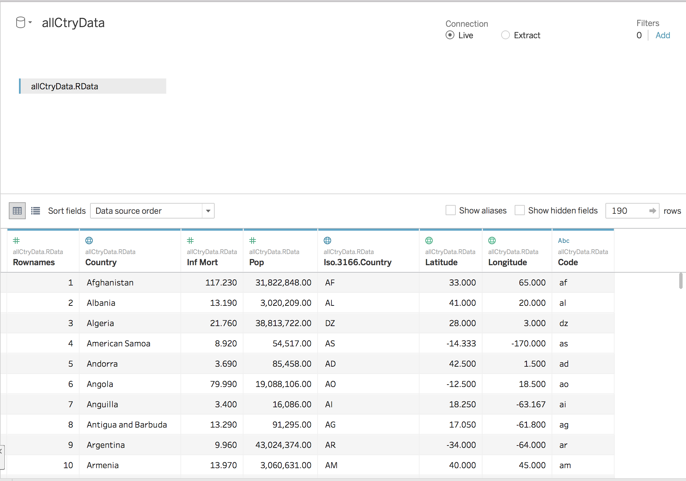
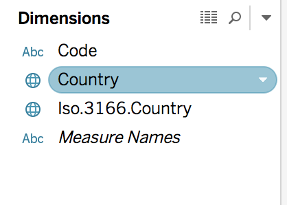
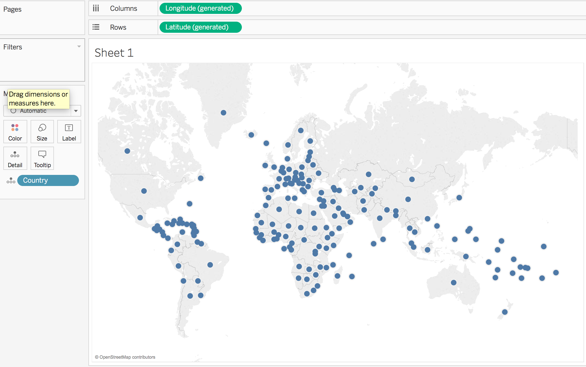
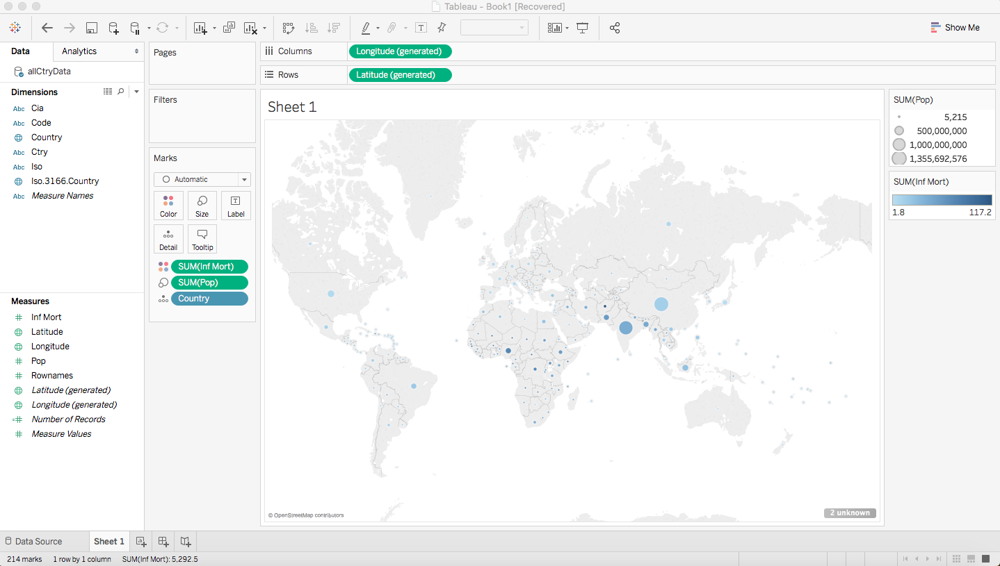
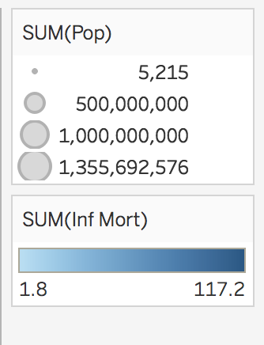
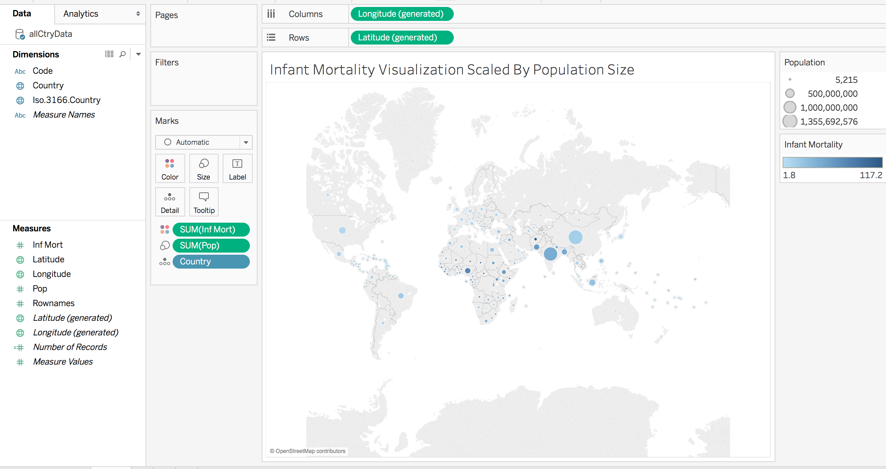

#### Introduction

In this document, we'll be recreating the visualization from the book using Tableau. We will be using the data we created earlier during the R visualization with the already merged data sets. If you haven't run the code from [case study 1 deck 3](cs01_3_deck.html), now is the time to do so, to ensure you have the data file ready for Tableau.

### Downloading Tableau

[Instructions for downloading Tableau](tableaudownload.html) are available online. Please do this before class (it can take a bit of time to activate the software).

### Importing & Opening the Data 
To begin, open Tableau desktop - you should see a screen similar to the below.

***
Then we will want to connect to our data set. Select the data tab on the top of the screen, then new data source. On the left-hand side there will be a blue panel with options for different kinds of data - recall that our file is an RData file, so select the option for "Statistical File". This should allow you to select the correct file from your computer. (If you didn't rename the file from the R tutorial, it'll be called "allCtryData.RData".)

***
Once you click the correct data set, a display similar to the figure below should appear.

***
Finally, in the bottom left corner there is a button labeled "Sheet 1". Click this, and then we're ready to begin creating our visualization!

### Infant Mortality Visualization

To begin, along the left-hand side there are two sections labeled "Dimensions" and "Measures". Click and drag "Country" from the Dimensions section to the center of the sheet into the large space labeled "Drop Field Here". 

***
This should automatically create a map with dots overlayed on the countries in our data set. (Note: If the map doesn't automatically appear, go to the map drop-down windown and select "Background Maps" and then "Offline".)

***
Then to edit our dots to reflect the infant mortality and population size, we will first drag and drop the population variable onto the "Size" button under the "Marks" section. This will scale the circles by population size. Then we'll drag and drop the Infant Mortality variable onto the "Color" button under "Marks". 

***
Thus, we've recreated the visualization from the R tutorial. Note Tableau was smart about scaling and did that for us!

### Miscellaneous: Editing Titles
Finally, we'll need to edit the titles from the default settings to more clearly reflect our data. 

***
To change them, we will click the drop-down arrow in the upper right corner of the label, and select "Edit Title". We can then change the title to anything we wish.

***
Then we can repeat this process with any other titles we wish to change. Then we have our final visualization.

###Explore!

Hover over points to see data details -- which country has more people, the US or Russia?  Which has a higher infant mortality rate? What are the names of all those South Pacific Islands?
