```{r setup, include=FALSE}
knitr::opts_chunk$set(echo = TRUE)

```

#### Introduction

In this document, we'll be creating a Tableau dashboard using the People and Society data set from the CIA factbook. The beginning of this tutorial is very similar to the Tableau visualization of infant mortality tutorial, so we'll go briefly through this section and then move onto creating the dashboard.  

### Importing The Data
Again we will begin by opening R and selecting the "Statistical file" option for importing the data. However, this time select the data set labeled [full.RData](data/full.Rdata). Now we are ready to move onto creating our sheets and then our dashboard.

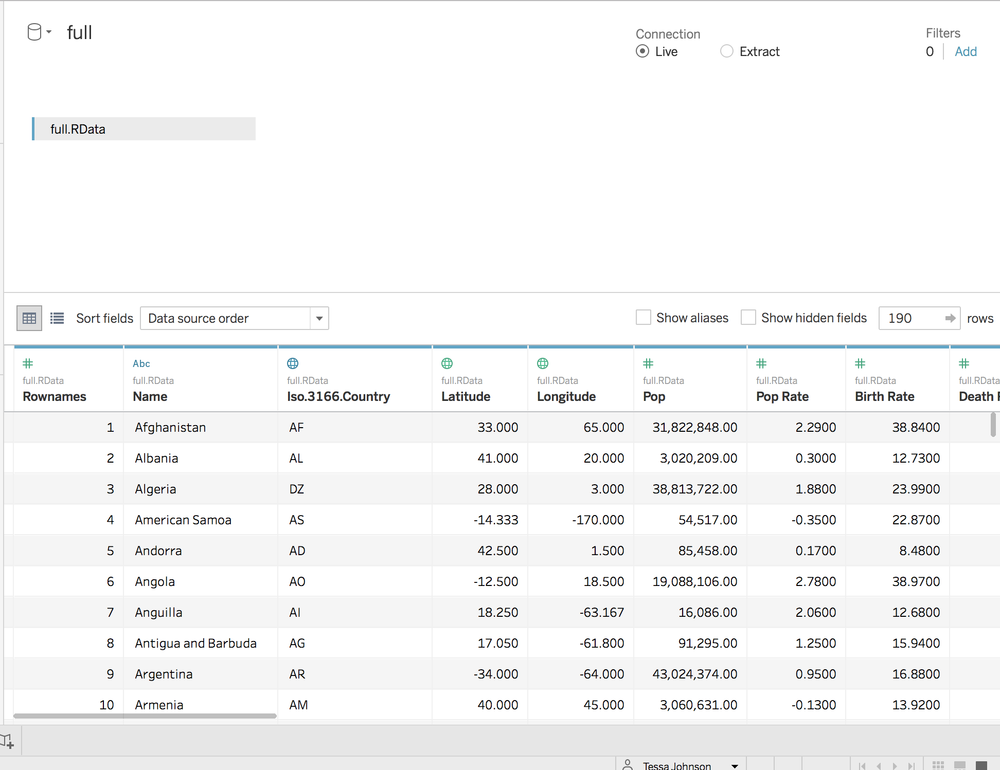{width=400px}

### Importing The Data
Again we will begin by opening R and selecting the "Statistical file" option for importing the data. However, this time select the data set labeled "full.RData" (this is available for download on the course website). Now we are ready to move onto creating our sheets and then our dashboard.

{width=400px}

### The Sheets
Before we create our dashboard, we must first create the figures that will go on it. Each figure will have its own sheet, and we can customize these sheets as much as needed.

***
##### A Note On Importing Data: 
Sometimes when data is imported into Tableau it may be in the incorrect format for the use we desire of it. So, we can change its data type by clicking the drop-down arrow on the right side and using the the "Change Data Type" option. (Note: You can also change the geographic role of a variable, i.e., we can tell Tableau which variable should be denoting countries, etc.).  Note for example by clicking on IM_total that Tableau read it as a text string, so change it to a continuous variable.

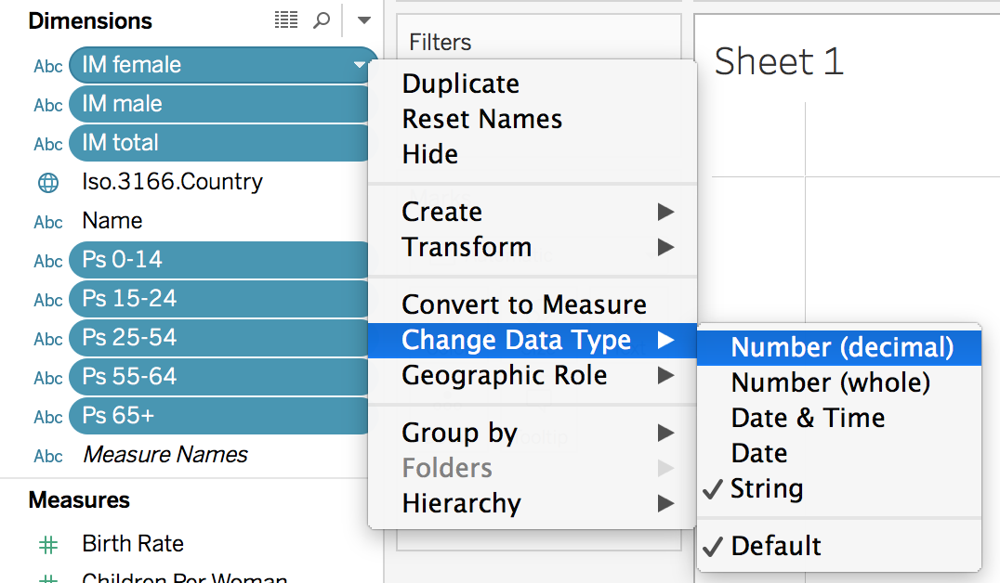{width=300px}

We can also change variables from dimensions to measures.

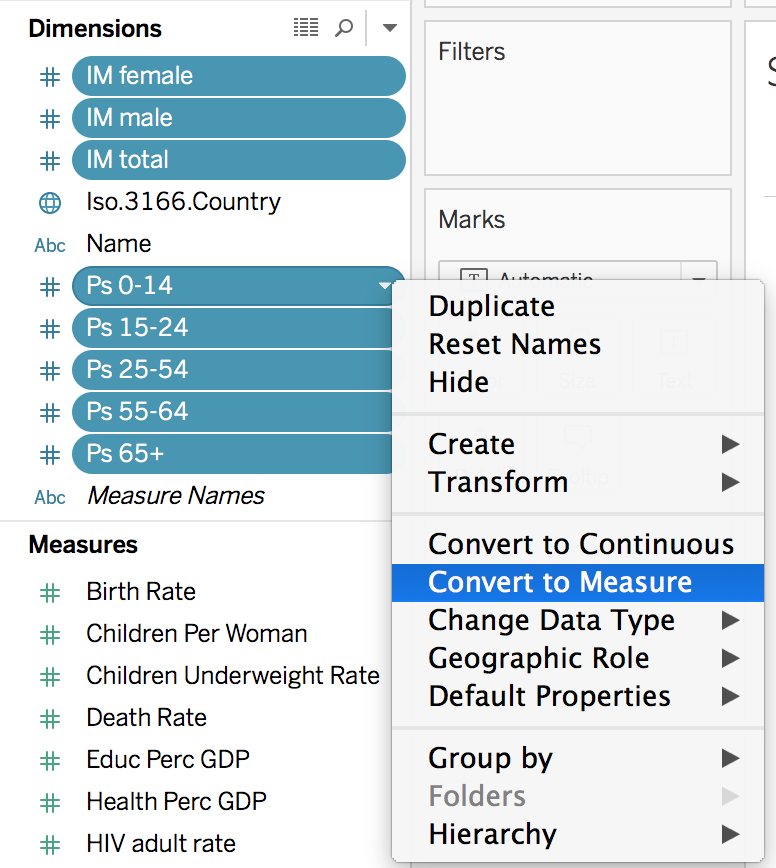{width=250px}


***

#### Sheet 1: The Map
The first figure we will create will be a map that's very similar to the map created in the previous tutorial. The only difference is that we will be coloring the circles by population rate rather than infant mortality.

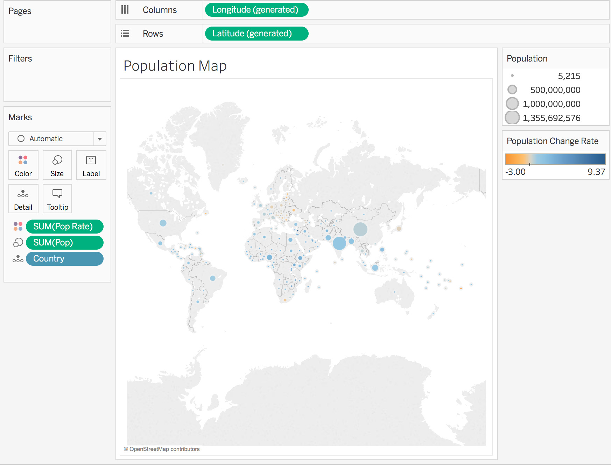{width=350px}

Then we will want to create another sheet for our next figure by clicking the far left icon on the bottom of the screen.

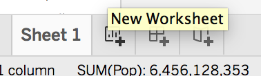{width=170px}

***

#### Sheet 2: Text Table
For our next figure, we will create a text table. To do this we will select the variables of interest and drag them into the center of the sheet (or into the "Measure Values" section). This will automatically create a text table of the variables.

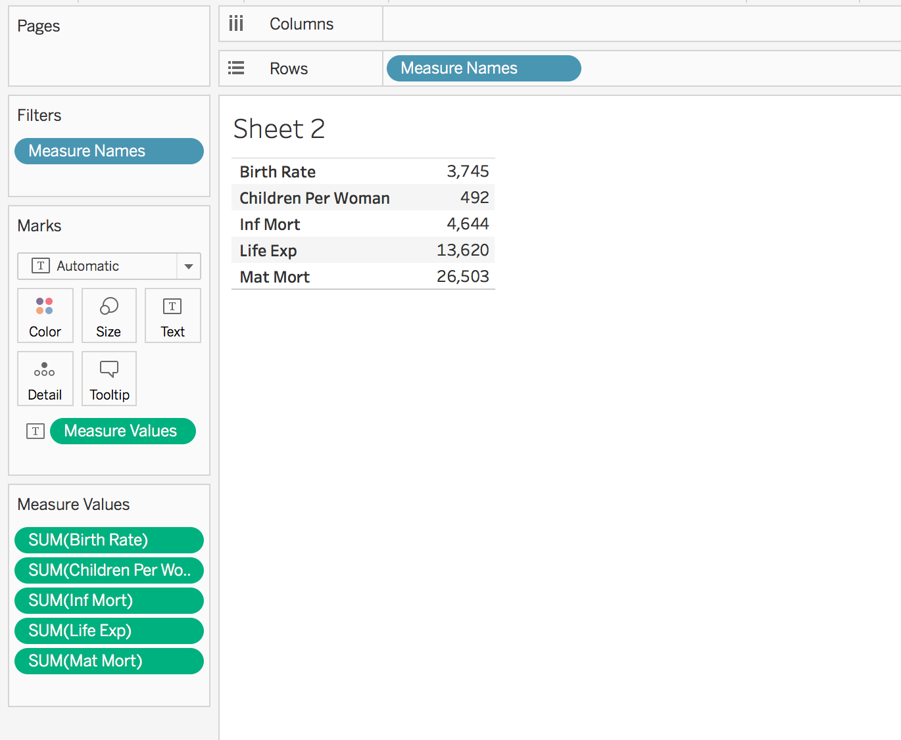{width=350px}

Note: if the "Measure Values" do not already show "SUM" instead of another type (e.g., "COUNT"), you can change them by clicking on the relevant bar labels. 
***

##### A Note On Variable Names: 
If you wish to change the names of variables, you will need to do so in the Data Source section. Go to the variable of interest and click the drop-down menu to rename the variable.

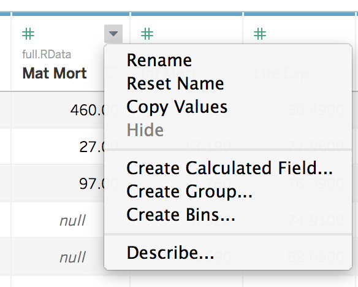{width=250px}

***

#### Sheet 3 & 4: Bar Charts
For our final two figures, we will be creating bar plots. To do this we will select the variables of interest and drag them into the center of the sheet (or into the "Measure Values" section). Then we will change the chart into a bar chart by clicking the "Show Me" button in the upper right corner, and selecting the appropriate plot. (Note: we could create many other types of plots in a similar manner)

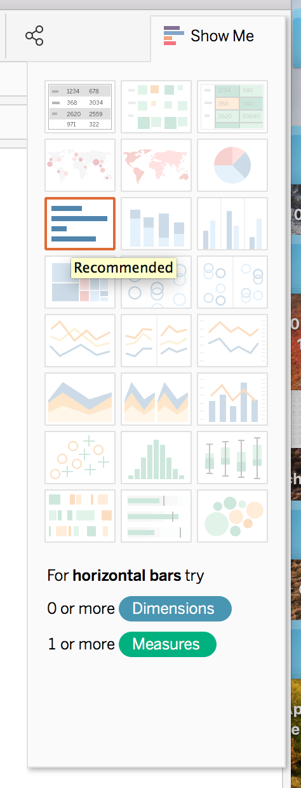{width=150px}
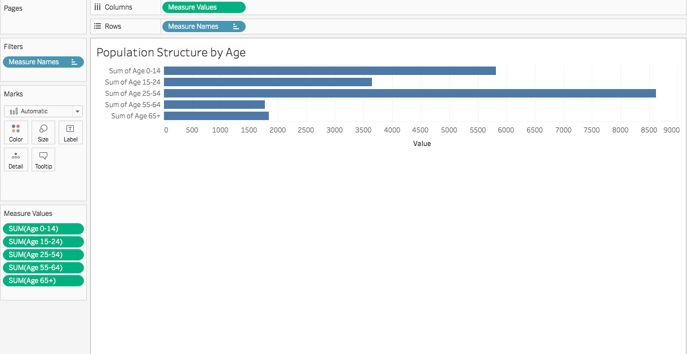{width=500px}

***

##### A Note On Customizing Charts: 
If we wish to edit the chart, we can do so using the marks section. For example, we could change the colors within the bars by selecting "Color".

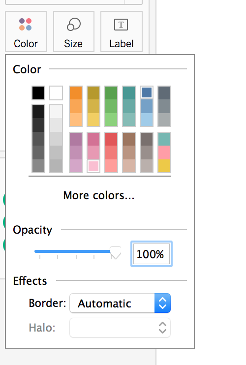{width=200px}
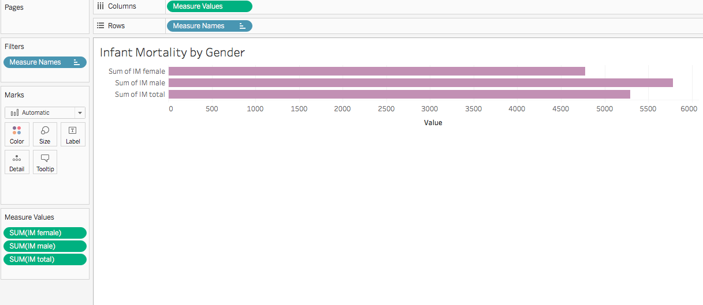{width=500px}

***

### The Dashboard
Finally, we can create our dashboard. First, we will want to click the "New Dashboard" button on the far right of the buttons at the bottom of the screen.

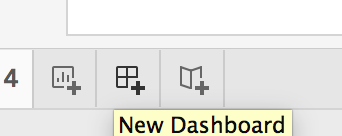{width=170px}

This will open a blank dashboard.

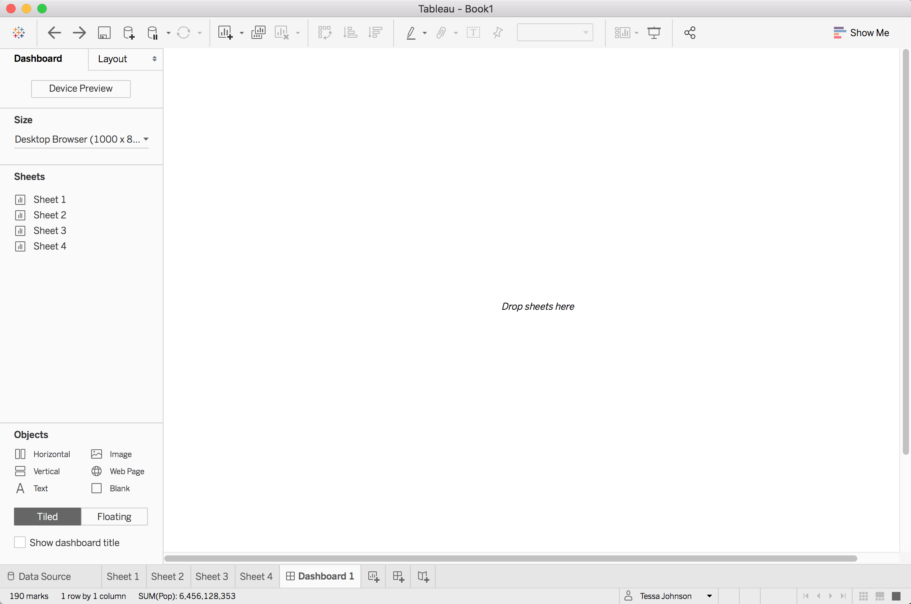{width=450px}

To create our dashboard, we will want to add our figures we've already created to this. Firstly, note that we can preview our figures by moving your mouse over the Sheets on the left-hand side.

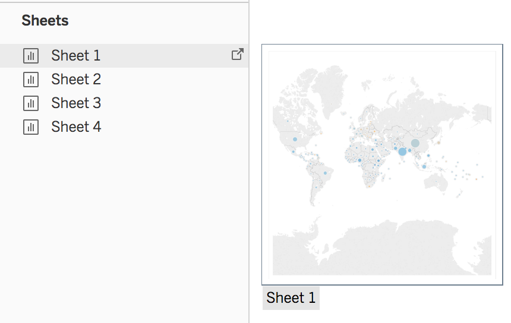{width=450px}

The first plot we will add will be our map. To do so - drag and drop the map onto the dashboard. 

Then we can add our other plots in a similar manner. The dashboard will highlight gray in the section where we can drop the plot. We can change the size of the plot by the clicking on the plot and manipulating the edges of the it.

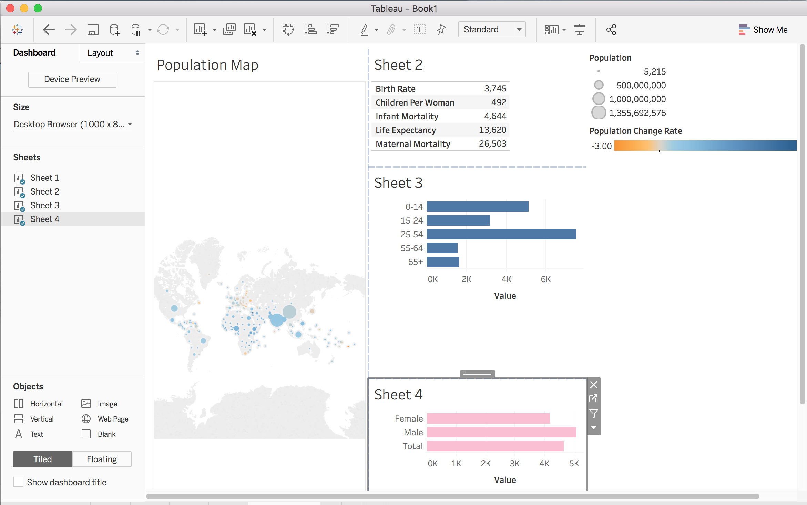{width=450px}
***

##### A Note On Filtering By Countries: 
If we want some of the plots, e.g. the bar plots, to change depending on the country, we can filter by country. Click on the map graphic and in the upper right corner click on the funnel to use that map as a filter. Then values of the other graphics/tables will change to be specific to any country you click on the map.

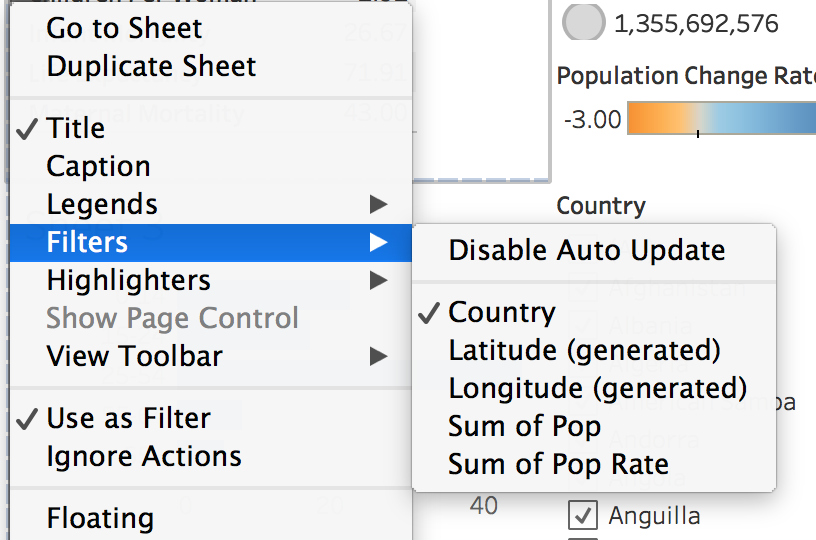{width=200px}

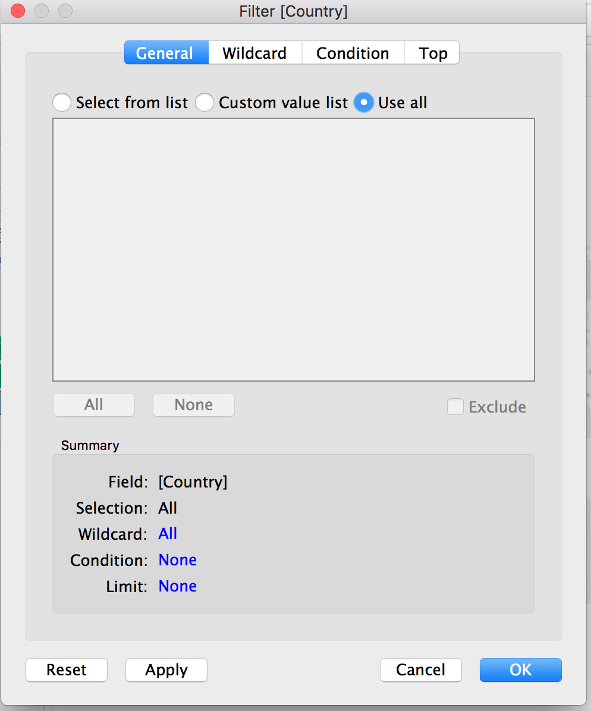{width=200px}

***

##### A Note On Naming with Countries: 
Now that we've set up a filter by country, we can adjust the names of the plots to change depending on the country. We will go to rename the sheet as usual and type in the name we desire for the plot. Wherever we want to insert the country name, click the "Insert" button and select Country.

{width=250px}


***

Now, we've finished our dashboard.

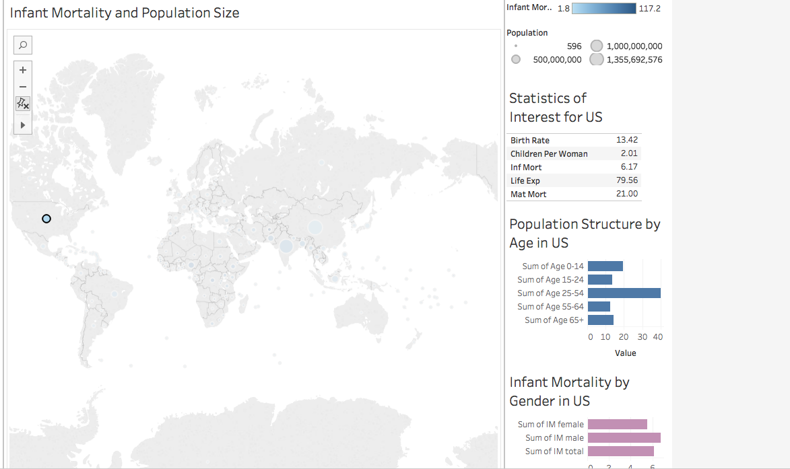{width=500px}
