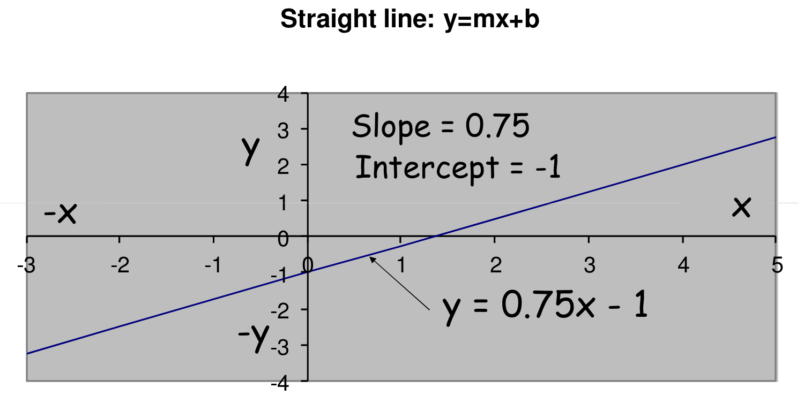
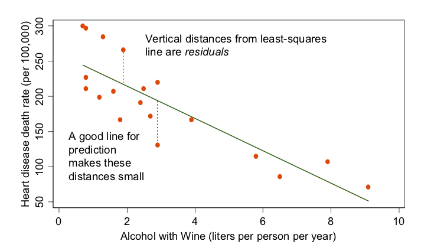

  
```{r setup, include=FALSE}
knitr::opts_chunk$set(echo = TRUE,fig.width=6, fig.height=5)
library(tidyverse)
library(knitr)
library(Hmisc)
```

## Next steps

- slide deck on logistic regression (start from slides for 440) and binomial regression


## Birth weight

Birth weight is a commonly-used indicator of a newborn infant's health status. Because this indicator is easily obtained, it is a critical component of population health reporting by the World Health Organization and governments around the globe. The distribution of birth weight has often been described as approximately normal, though the left tail in particular is inflated relative to that from a Gaussian distribution.

## <small> Review: Slope-intercept form of line </small>



* Here, $m=0.75$ and $b=-1$
* $b$ is the y-intercept, or where the line crosses the y-axis.  It is the predicted value of $y$ when $x=0$


## <small> Review: Slope-intercept form of line </small>


* $m$ is the slope, which tells us the predicted increase in $y$ when $x$ changes by 1 unit
* What is our predicted $y$ when $x=2$?


## <small> Review: Slope-intercept form of line </small>


* In statistics, we often represent the slope with $\beta_1$ and the intercept with $\beta_0$, and these values are usually not known but must be estimated, yielding $\widehat{\beta}_0$ and $\widehat{\beta}_1$. What are those values here?


## Linear regression review



What are the approximate values of $\widehat{\beta}_0$ and $\widehat{\beta}_1$ and their interpretation?


## Read data into R
We will evaluate whether there is a relationship between the response, birth weight, and the predictors gestational age (measured in weeks) and sex.

* Check for NAs in data - appear as 9, 99, 9999 for our variables of interest (birth weight, gestational age, and sex)
* For now, remove the rows with missing values
* Focus on most recent year with data, 2016
* Do some rudimentary data cleaning
```{r readdata}
#Read in birth data
o_data <- read.csv("~/Documents/TEACHING/vitalstats/Yr1116Birth.csv", 
  na.strings=c("9","99", "9999"))
#SEX=1 male, 2 female; male=1 male, 0 female
o_data$male=2-o_data$SEX #binary gender for interpretation
o_data$GEST_C=o_data$GEST; o_data$BWTG_C=o_data$BWTG
o_data$GEST_C[o_data$GEST_C>50]=NA
o_data$GEST_C[o_data$GEST_C<20]=NA
o_data$BWTG_C[o_data$BWTG_C<500]=NA
birth_data <- na.omit(o_data)
birth_data_2016=birth_data[which(birth_data$YOB==2016),]
```

## Is birth weight normally distributed?
* Compare histogram of birth weight to a normal distribution parameterized with a mean and variance that is set based on birth weight variable, `BWTG`.
* Do the distributions align?
  
```{r histogram, out.width = '50%', echo=FALSE }
par(mfrow=c(1,2))
hist(birth_data$BWTG, xlab="Birth weight (g)", main="Birth weight Histogram", prob=TRUE, breaks=50)
curve(dnorm(x, mean=mean(birth_data$BWTG), sd=sd(birth_data$BWTG)),
      col="darkblue", lwd=2, add=TRUE, yaxt="n")
hist(birth_data$BWTG, xlab="Birth weight (g)", main="Birth weight Histogram", prob=TRUE, xlim=c(0, 4000), breaks=30)
curve(dnorm(x, mean=mean(birth_data$BWTG), sd=sd(birth_data$BWTG)),
      col="darkblue", lwd=2, add=TRUE, yaxt="n")
```

## Linear regression
Let $y_i$ denote the observed response, 'BWTG', for observation $i$, and $x_i$ the observed covariates, 'GEST' and 'male'. Then we aim to fit the model:

$$ y_i = \beta_0 + \beta_1 \text{GEST}_i + \beta_2 \text{male}_i + \epsilon_i $$

When we fit the line, we estimate the coefficients $\mathbf{\widehat{\beta}}= \{\widehat{\beta}_0, \widehat{\beta}_1, \widehat{\beta}_2\}$, where $\widehat{\beta} = (X^\prime X)^{-1} X^\prime Y$.

$$ \widehat{y}_i = \widehat{\beta}_0 + \widehat{\beta}_1 \text{GEST}_i + \widehat{\beta}_2 \text{male}_i  $$
We denote residuals, $e_i = y_i - \widehat{y}_i$ where $\widehat{y}_i$ is the estimated predicted value for observation $i$.

## Model Assumptions
To make inference on the model parameters, $\beta$, we check four assumptions for the linear regression model:

1. The mean of the response, $E(y_i) = \beta_0 + \beta_1 \text{GEST}_i + \beta_2 \text{male}_i$ is **linear function** of the $x_i$ at each value of the predictors $x_i$.
2. The errors, $\epsilon_i$, are **independent**.
3. The errors, $\epsilon_i$, at each value of the predictor, $x_i$, are **normally distributed**.
4. The errors, $\epsilon_i$, at each value of the predictor, $x_i$, have **equal variances**.

Or in summary, we assume the errors, $\epsilon_i$, are independent, normally distributed with zero mean and constant variance:
$$\epsilon_i \overset{\text{iid}}{\sim} \text{Normal}(0, \sigma^2).$$


## Fit regression to data
Let's fit a linear model using the function `lm`. 
```{r firstmodel, cache=TRUE}
model1 = lm(BWTG~GEST+male, data=birth_data)
summary(model1)
```

How do we interpret the results?

## Look at residuals
What do the residuals tell us about model fit?
```{r residuals, out.width= '50%',cache=TRUE }
par(mfrow=c(2,2))
plot(model1)
```


## Guide to residual plots

- RxP plot (residuals versus fitted): you want to see a "happy cloud" of residuals with no obvious trends or patterns, centered around 0

- Q-Q plot (standardized residuals vs order stats from normal): want to see a straight line with slope 1

- Scale-Location plot (are residuals spread equally across range of predictors?): want equal spacing of points with horizontal smoother

- Residuals vs Leverage (are outliers influencing model fit?): look for points in top and bottom right side corners to see if outliers are also high leverage points that may affect fit of line

## <small> It is also a good idea to examine the predictions from the model against the true observed values </small>

```{r predplot, out.width='50%', cache=TRUE}
ggplot(data = birth_data, mapping = aes(x = model1$fitted.values, y = BWTG)) +
  geom_point(alpha=1/20) + geom_abline(intercept=0,slope=1,col='red') + 
  xlab("Predicted birth weight (g)") + ylab("Observed birth weight (g)") 

```

What do you notice about the predicted values?

## Diagnosing the problem

Diagnostic plots of the model are essential for checking model fit. Some common remedies depending on the problem include the following.

  * Model improvements - predictions can often be improved by refining the mean model, e.g. by including polynomial terms or interactions
  * Deletion of outliers - often done in practice, but throwing away data is generally a bad idea. Careful data cleaning is often helpful (and some algorithms are availble for vital records data).
  * Transformations (e.g. sqrt(BTWG)) - transforming outcome may fix skewness but can make interpretting the model more difficult
  * Robust regression - use a more flexible regression model to accommodate the data. While there are many methods for robust regression, they share a general strategy of giving lower weight to observations that have large influence on the regression model fit.


## Interaction
In some cases, the association between a predictor and the outcome may depend on a third variable, indicating an interaction term is needed. Let's see if the gender-birth weight relationship is constant over gestational age.

$$ y_i = \beta_0 + \beta_1 \text{GEST}_i + \beta_2 \text{male}_i + \beta_3 \text{GEST}_i\text{male_i}+\epsilon_i  $$

* What is the slope for males? Females?
* How do you determine if gender is related to birth weight?  If gestational age is related to birth weight?

## Interaction code

```{r intmodel,cache=TRUE}
model2 = lm(BWTG~GEST+male+GEST*male, data=birth_data)
summary(model2)
```

## Class Exercise:

Fit a regression model with birth weight as the outcome and predictors including biological sex, total pregnancies (dichotomized as 1 or >1), smoking status (dichotomized as any versus none), and gestational age (linear term in weeks). Explore whether interaction or polynomial terms improve model fit.


