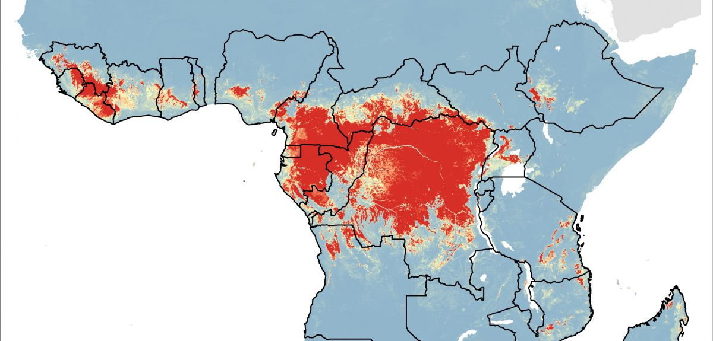

  
```{r setup, include=FALSE}
knitr::opts_chunk$set(echo = TRUE,fig.width=6, fig.height=5)
library(pwr)
```


## Public health crisis

Suppose you're on a team designing a trial of a new vaccine to prevent Ebola infection. How do you determine how large the sample size must be to detect any potentially protective effect?

{width=80%}

## Why calculate sample size and power?

- To show that under certain conditions, a study/hypothesis test has a good chance of showing evidence of an anticipated treatment difference, if that treatment difference truly exists
- To be more confident that a null result is not due purely to high variance and a small sample size
- To show a funding agency that the study has a reasonable chance of reaching a useful result
- To show that necessary resources (e.g., human, financial, time) will be minimized

## Is your birth control pill working?

Suppose you want to ensure a new manufacturer of birth control pills provides the correct dosage of 0.02 $\mu$g estrogen. How many pills do you need to sample in a shipment in order to detect (with high probability) a difference of 10\% in the intended and measured dose?

{width=60%}


## Study design

Proper study design depends on a variety of factors, including

- mechanism of allocation to groups (e.g., randomization or self-selection)
- measurement scale of variables of interest
- hypothesis of interest
- clinically meaningful difference in treatments
- cost of carrying out the study
- time needed to carry out the study

## Null hypothesis significance testing framework

Generally, we address the research question in terms of *null* and *alternative* hypotheses, e.g.

$H_0:$ nothing is going on

$H_A:$ something interesting is going on

For the Ebola study, our null hypothesis might be that the vaccine is ineffective, while the alternative might be that the risk of infection is different among those vaccinated.

For the birth control example, the null hypothesis would be that the pills do contain the required estrogen dose, while the alternative would be that they do not.

We gather data in a study in hopes of *rejecting* the null hypothesis in favor of the alternative.

## Power

*Power* is the probability of rejecting the null hypothesis when it is indeed false, e.g. $$\text{power}=Pr(\text{reject} ~ H_0 \mid H_0 ~ \text{false})$$ and can be thought of as the likelihood a planned study will detect a deviation from the null hypothesis if one really exists.  Power is a function of

- sample size $n$ (larger $n$, higher power)
- size of a clinically significant deviation from the null (easier to detect bigger differences, but sometimes big differences are unrealistic)
- standard deviation (the lower the variance, the higher the power)
- $\alpha$, the significance level or type I error rate (smaller acceptable error rates require larger sample sizes to achieve the same power)

## Power

When we design a study, we want to have

- a small probability of rejecting $H_0$ when it is in fact true ($\alpha$)
- a large probability of rejecting $H_0$ when it is in fact false (power)

Current standards dictate $\alpha$ no greater than 5\% and power no less than 80\%

The typical manner in which we increase power is to increase our sample size $n$.

## Minimum detectable difference

Consider the birth control example.  Our null hypothesis is $H_0: \mu=0.02$, and our alternative hypothesis is $H_A: \mu \neq 0.02$. In order to calculate power, we need to specify a *minimum detectable difference*, often denoted $\delta=\mu_A-\mu_0$, such that we reject $H_0$ with a certain power (e.g., 90\%) when in fact $\mu=\mu_A$. We need a bigger sample size when $\delta$ is small, and fewer subjects when $\delta$ is large. 

In the birth control setting, we wanted to be able to detect a difference of 10\%, so that $\delta=0.002$.

## Effect size

The minimum detectable difference is often scaled by the standard deviation (SD, or $\sigma$) to put it in standardized units. For example, if the standard deviation in the birth control example is $\sigma=0.008$, then the *effect size* of our minimum detectable difference is $\frac{\delta}{\sigma}=\frac{0.002}{0.008}=0.25$, or a quarter of a standard deviation.

Often effect sizes of 0.2 SD's or less are considered to be on the small side, and those of say 0.8 or greater are considered to be on the large side (Cohen).

## Sample size for two-sided, one-sample test of the mean
Suppose we wish to test $H_0: \mu=\mu_0$ against the alternative $H_A: \mu \neq \mu_0$ using a one-sample test. The sample size is given by $$n= \left(\frac{\sigma \left(z_{\frac{\alpha}{2}}+z_\beta\right)}{\delta}\right)^2$$

The important parts to remember are that your required sample size gets bigger when your variance ($\sigma^2$) is larger, and it gets bigger when you are trying to detect smaller differences $\delta$. We'll watch this in action using a very nifty applet! (The sizes of the shaded areas in this nifty applet map to the values $z_{\frac{\alpha}{2}}$ and $z_\beta$, in case you are curious about these values, which dictate the error rates we will tolerate in our procedure.)

## Power applet

This [nifty applet at Rpsychologist](http://rpsychologist.com/d3/NHST/) shows for a one-sample test of means (e.g., think of the birth control pill setting), the interplay between power, the significance level, effect size (minimum detectable difference in SD units), and sample size.

## Power calculations in R

R has a nice package, `pwr`, that allows us to calculate power for basic tests of means and proportions, in addition to simple regression settings.

```{r pwr}
library(pwr)
```

## Power calculations in R

For the birth control pill example, when we want to be able to detect a difference of 0.002, corresponding to an effect size (difference/$\sigma$) of $\frac{0.002}{0.008}=0.25$, calculate the required sample size as follows, assuming a type I error rate of 5\% and power of 90\%.

```{r bc}
pwr.t.test(d=0.25,sig.level=0.05,power=0.9,type=c("one.sample"))
```

Thus to get 90\% power we need to sample 171 pills (round up to be conservative).

## Power for tests of proportions

In the Ebola example, we are interested in a two-sample test comparing the proportions in each group (placebo and vaccine) who become infected. Thus our null hypothesis is $$H_0: \pi_{placebo}=\pi_{vaccine}$$ with an alternative of $$H_A: \pi_{placebo} \neq \pi_{vaccine}.$$ While we hope the vaccine is better than the placebo, we usually avoid *one-sided* tests, in part because of the risk of adverse or unanticipated events due to the vaccine.

Suppose we expect that the risk of infection for people not receiving the vaccine during the time of the study is 1\%, and we want to see if the vaccine can cut this risk in half or more.  Then our minimum detectable difference is the difference between  1\% and 0.5\%.

## Power for tests of proportion

Some software packages allow you to input the two proportions, $\pi_{placebo}$ (here 1\%) and $\pi_{vaccine}$ (here 0.5\%), directly. However, the `pwr` function calculates the effect size using an arcsine (inverse sine) transformation, which has desirable statistical properties.

I assume you do not want to go back to trignometry, so I am going to write a little R function to calculate the effect size for us.

## Effect size for proportions

```{r effectsize}
effectsize=function(p1,p2) {
  h=2*asin(sqrt(p1))-2*asin(sqrt(p2))
  return(h)
}
```

Now we can call the R function using our proportions directly instead of having to work out the transformation.

## Ebola power calculation

Suppose we want to know the required sample size (per group) in the Ebola study for $\alpha=0.05$ and 90\% power.

```{r ebolapwr}
pwr.2p.test(h=effectsize(0.01,0.005),sig.level=0.05,power=.9)
```

So we need 6080 people in each group!  Why do we need so many people? 

## Ebola power calculation

 Well, Ebola is thankfully rare, so we will not have many infections. If we could conduct the study in an area with a higher incidence rate, we would not need as many people. However, operationally it could be very difficult to get a study off the ground in the middle of an epidemic.
 
 Suppose, however, you could run a study in a town currently experiencing an epidemic, and that you expect 2\% of the population will contract Ebola, and again you are curious about whether the vaccine can cut that incidence rate in half (or more).
 
## Ebola power calculation 

```{r ebolapwrdouble}
pwr.2p.test(h=effectsize(0.02,0.01),sig.level=0.05,power=.9)
```

Wow, that's a big difference. 

(Now, we could also have calculated power using other outcomes, such as Ebola deaths or time to infection, which would change the required sample size.)

## Sugar drink tax

Suppose we wish to test the efficacy of a tax on sugar drinks. How might we design and carry out the study? What factors do we need to determine to calculate power?
