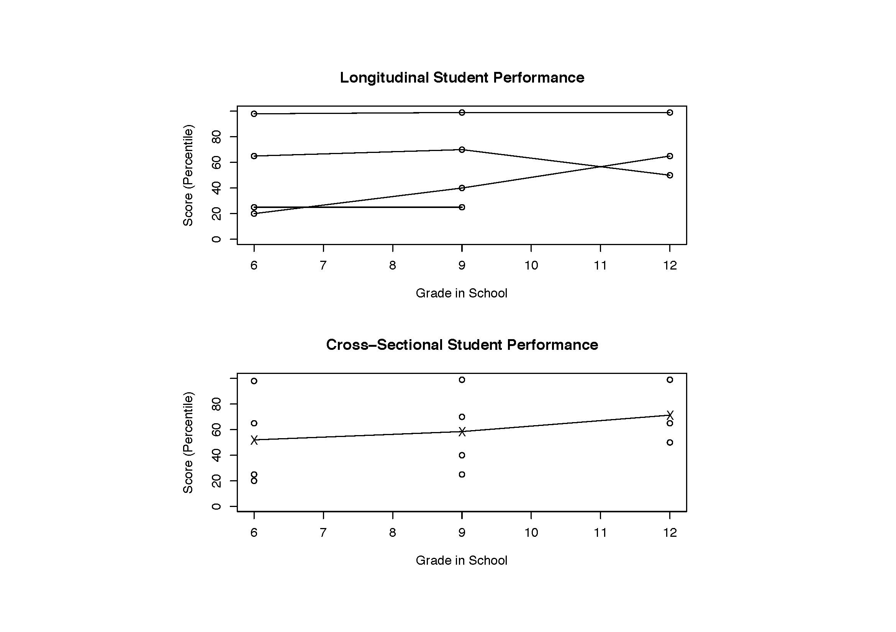

```{r setup, include=FALSE}
knitr::opts_chunk$set(echo = TRUE)
library(countrycode)
library(knitr)
```

## Case Study 4: Longitudinal Data Analysis

In this case study we will explore challenges related to the analysis of longitudinal data, including how to handle repeated measures collected on individuals and principled methods of dealing with missing observations.

## <small> Univariate and Multivariate Responses </small>

When each subject gives rise to a single response measurement, we
typically use *univariate* analysis.

When each subject gives rise to a vector of dierent response
measurements, we typically use a *multivariate* analysis. In a special
case, in which each subject gives rise to a vector of response
measurements, and these measurements represent the same type of
response measured at a sequence of observation times, we use
*longitudinal* analysis.

## Studying TIme Trends

In a *longitudinal* study, subjects are measured repeatedly over time.

In a *cross-sectional* study, a single outcome is measured for each
individual, though individuals may belong to different cohorts.

## <small> Longitudinal Versus Cross-Sectional Analysis </small>




## <small>Longitudinal vs Cross-Sectional Analysis </small>

A key feature of the longitudinal design above is that one cohort of
students, recruited in 6th grade, is followed until 12th grade
(except in the case of dropouts). The cross-sectional study can be
completed at one point in time, with the 6th, 9th, and 12th grade
cohorts tested concurrently.

Question: Are the 12th grade teachers better than the 6th or 9th
grade teachers, or are test scores higher due to other factors, e.g.
better teachers earlier in school, dropout of the poorest students,
or a particularly bad group of 6th graders?

## <small>Longitudinal vs Cross-Sectional Analysis </small>

In the cross-sectional design, we do not have any repeated scores
from the same student. Often, all observations may be treated as
independent.

In a longitudinal analysis, we can investigate

* changes over time within individuals
* differences among individuals in their response levels

Longitudinal data analysis requires special statistical methods
because the observations on any one subject tend to be positively
correlated.

## Why Special Methods?

Repeated observations $Y_{i1}, Y_{i2}, \ldots, Y_{in_i}$ from subject i are likely to be positively correlated, violating the typical modeling assumption of independence.

What if we ignore the correlation and use standard methods (e.g.,
linear regression) anyway?

* Inferences may be incorrect (variance estimates too small or
too large)
* Covariance itself may be of interest
    * Does a cancer treatment work equally well for all patients, or is
there heterogeneity in the response to treatment? (If you're
sick, you want to know!)

## <small> Characteristics of Longitudinal Data </small>

* Repeated observations taken on individuals enable direct
study of change
* May be retrospective or prospective
* May involve multiple time scales that are interdependent
    * Age of subject (e.g., 25 or 35)
    * Period or calendar date of measurement (e.g., 1995 or 2005)
    * Cohort (e.g., year of birth)
* Require special analysis methods due to correlation of
observations within individuals
* Often, individuals or subjects are considered to be independent

## <small>Longitudinal vs Cross-Sectional Analysis </small>
Consider a simple model with no intercept.

* Cross-sectional study: n_i=1
    * $Y_{i1}=\beta_CX_{i1}+\varepsilon_{i1}$, $i=1,\ldots,N$
    * $\beta_C$ represents the difference in average $Y$ across two sub-populations that differ by one unit in $X$
* Longitudinal study: n_i>1
    * $Y_{ij}=\beta_CX_{i1}+\beta_L(X_{ij}-X_{i1}) + \varepsilon_{ij}$, $j=1,\ldots,n_i$, $i=1,\ldots,N$
    * By subtracting the cross-sectional from the longitudinal model, we can see how to interpret $\beta_L$: $$(Y_{ij}-Y_{i1})=\beta_L(X_{ij}-X_{i1})+\varepsilon_{ij}-\varepsilon_{i1}$$
    * $\beta_L$ represents the expected change in $Y$ over time per one unit change in $X$ for a given subject

## <small>Longitudinal vs Cross-Sectional Analysis </small>
* In a cross-sectional study, we can compare individuals with a particular value of X to individuals with different values of X
* In a longitudinal study, each person serves as his or her own "control."  That is, $\beta_L$ is estimated by comparing a person's response at two times assuming that X (e.g., age, time since diagnosis) changes over time
* In a longitudinal study, we are able to distinguish the variation in Y across time for one individual from the variation of Y across different individuals.

## <small>Longitudinal vs Cross-Sectional Analysis </small>

Recall the study of academic performance of students. Suppose we wish to estimate each student's performance in 11th grade, even though formal assessments only occurred in grades 6, 9, and 12.

{width=55%}

## <small>Longitudinal vs Cross-Sectional Analysis </small>
* Cross-sectional study: estimate of one subject's score draws
upon data from other subjects in order to overcome any
measurement error. This averaging across people ignores
biological variability in test scores across different people.
* Longitudinal study: estimate of one subject's score draws
upon data from other subjects as well as data over time in the
individual subject. If there is not much variability across
subjects, then one subject's estimated status can rely heavily
on data for other subjects; however, if there is a large amount
of variability among people, it may be preferable to rely
mostly on that subject's achievement trends over time.

## Notation

${\bf Y}_{n \times 1}=\begin{pmatrix} Y_1 \\ Y_2 \\ \vdots \\ Y_n \end{pmatrix}$ is a random vector of response observations.  We denote an individual i's response values as ${\bf Y}_i=\begin{pmatrix} Y_{i1} \\ Y_{i2} \\ \vdots \\ Y_{in_i} \end{pmatrix}$.

## Correlated Data

We often, but not always, assume that while separate individuals may have independent responses, the response values from within an individual may be correlated.  Often, but not always, we assume this correlation is positive.

## Covariance Matrix
The *covariance* matrix is given by
\begin{eqnarray*}
\boldsymbol{\Sigma}_{n \times n}&=& E(({\bf Y}-\boldsymbol{\mu})({\bf Y}-\boldsymbol{\mu})') \\
&=& 
\begin{bmatrix} 
\sigma_{11} & \sigma_{12} & \cdots & \sigma_{1n} \\
\sigma_{12} & \sigma_{22} & \cdots & \sigma_{2n} \\
\vdots & \vdots & & \vdots \\
\sigma_{1n} & \sigma_{2n} & \cdots & \sigma_{nn} 
\end{bmatrix}.
\end{eqnarray*}

Thus $\sigma_{11}$ is the variance of the first response, and $\sigma_{12}$ is the covariance of the first and second responses. Variances and covariances determine correlation.

## Correlation Matrix

The *correlation* matrix of ${\bf Y}$ is defined as
\begin{eqnarray*}
{\bf R}_i=\text{Corr}({\bf Y}_i)=\begin{bmatrix}
1 & \rho_{12} & \cdots & \rho_{1n} \\
\rho_{12} & 1 & \cdots & \rho_{2n} \\
\vdots & \vdots & & \vdots \\
\rho_{1n} & \rho_{2n} & \cdots & 1 
\end{bmatrix},
\end{eqnarray*}
where $\rho_{jk}=\frac{\sigma_{jk}}{\sqrt{\sigma_{jj}\sigma_{kk}}}$ and $-1 \leq \rho_{jk} \leq 1$.

## Covariance Structures

Statistical models may parameterize the covariance of longitudinal data in different ways. The forms given on the previous slides show an *unstructured* covariance, which makes no assumptions but involves a lot of parameters to estimate. 

With longitudinal data, we can generally make a number of assumptions about how observations are related over time to reduce the number of parameters we are estimating. For example, we may assume correlations are positive, or that certain natural patterns exist.

## Covariance Structures

Some popular options for modeling covariance include:

- Homogeneous compound symmetry: variances and correlations are constant over time; that is, $\sigma_{11}=\sigma_{22}=\cdots=\sigma_{nn}=\sigma$ and $\rho_{jk}=\rho_{j'k'}=\rho$
- Heterogeneous compound symmetry: variances may change over time but correlations remain constant: $\rho_{jk}=\rho_{j'k'}$ and we estimate $n$ different variance components $\sigma_{11}, \ldots, \sigma_{nn}$. This can be a bad choice if the measurement times are not the same for all subjects (as $n$ may get pretty big)
- Autoregressive: works with homogeneous or heterogeneous variances; correlation decreases over time in a specified manner, such as AR(1), which indicates $\rho_{j,j+1}=\rho$, $\rho_{j,j+2}=\rho^2,$ etc.